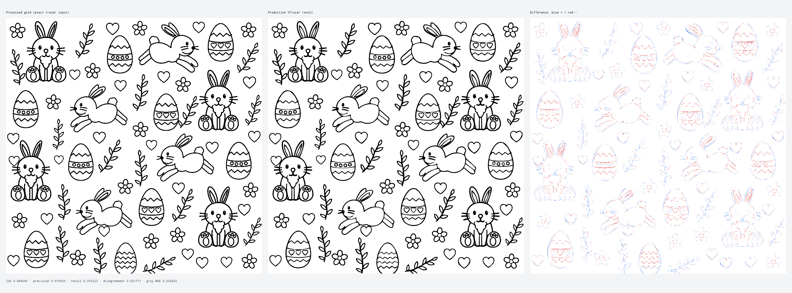

# Semantic SVG gold benchmark

This benchmark measures the production VTracer path against a controlled, vector-first source after applying the same kind of raster preprocessing used by Cylinder Seal Studio. It is both a normal Vitest quality gate and a reproducible way to create review artifacts.

## What is—and is not—the gold standard

`public/sample.png` is the visual reference. `gold-standard.svg` is a VLM-authored, independently reviewed semantic reconstruction of its motif vocabulary and composition. It is not a claim about the original PNG's provenance, nor is it literal pixel-level ground truth for that PNG.

It becomes controlled ground truth only for the vector-first experiment: because its geometry is deliberately assembled from known SVG paths, symbols, transforms, fills, and strokes, we can rasterize it and measure how much the tracing pipeline recovers. The exact numerical oracle is the opaque black/white raster produced from that SVG by the neutral preprocessing profile below—not the antialiased render and not the original sample. This distinction keeps claims about the tracer honest while preserving the visual character we want to study.

`bunny-symbols.svg` and `ornament-symbols.svg` contain the reusable, hand-authored motif geometry used to construct the controlled master. They are source material rather than independent benchmark cases.

The master must remain self-contained: inline any required symbol definitions and avoid external images, fonts, or network resources. That keeps rendering deterministic in local development and CI.

## Neutral preprocessing profile

The source is rendered at 1024 × 1024 and transformed with deterministic array operations, without a DOM or canvas:

- threshold: `170`;
- edge softness: `0`;
- invert: `false`;
- mirror: `false`;
- seam band: `false`.

Each source pixel is converted to luminance with the production coefficients (`0.299 R + 0.587 G + 0.114 B`). Luminance below 170 becomes opaque black; everything else becomes opaque white. This `processed-gold-raster` is passed to VTracer and is also the comparison target. The profile intentionally removes UI transformations and isolates tracing behavior.

## Running it

The benchmark runs without writing files as part of the normal suite:

```sh
npm test
```

To run only this case and write comparison artifacts:

```sh
npm run benchmark:svg
```

That command writes to `benchmarks/svg-gold/output/`:

- `source-raster.png` — the antialiased semantic SVG render before preprocessing.
- `processed-gold-raster.png` — the exact opaque black/white raster supplied to VTracer and used as the numerical oracle.
- `traced.svg` — production VTracer output normalized by `formatFlatSvg` to 39.89823 mm × 40 mm.
- `traced-raster.png` — the normalized trace rendered in the same pixel viewport.
- `diff.svg` and `diff.png` — false-positive pixels in blue and false-negative pixels in red.
- `comparison.svg` and `comparison.png` — labeled gold, trace, and difference panels.
- `report.json` and `report.md` — deterministic visual, topology, SVG-structure, and hash results.

Generated files are diagnostic artifacts; `gold-standard.svg` is the maintained source of truth. The compact PNGs, normalized trace, and reports form a reviewable baseline. The very large per-pixel and embedded-image SVG intermediates are reproducible but intentionally ignored by Git.

The committed baseline comparison shows the exact tracer input, normalized production output, and color-coded difference:



## Quality gates

The processed gold and traced renders use a white background and a 1024 × 1024 viewport. Metric pixels with luminance below 128 are foreground; because the processed gold is already binary, this metric threshold does not alter the tracer input. The committed gate requires:

- foreground intersection-over-union of at least 0.84;
- precision of at least 0.90;
- recall of at least 0.91;
- binary pixel disagreement of at most 0.03;
- a self-contained semantic gold source whose references are all internal;
- a complete, finite, fill-only normalized SVG with no white background paths; and
- byte-for-byte deterministic tracing under `DEFAULT_TRACE_SETTINGS`.

The report also records normalized grayscale mean absolute error, connected foreground components, enclosed background holes, path and command counts, byte sizes, and SHA-256 hashes. Those diagnostics are intentionally reported without brittle topology or path-count gates.

See [`TUNING.md`](TUNING.md) for the bounded settings sweep, the original-sample sanity check, and the visual rationale for the selected smooth production profile.
